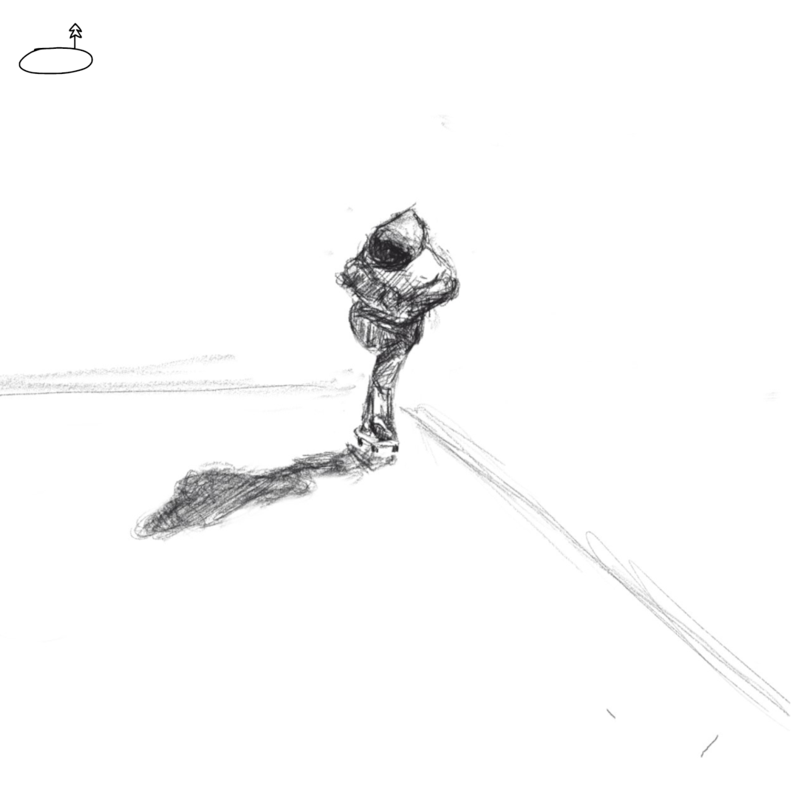
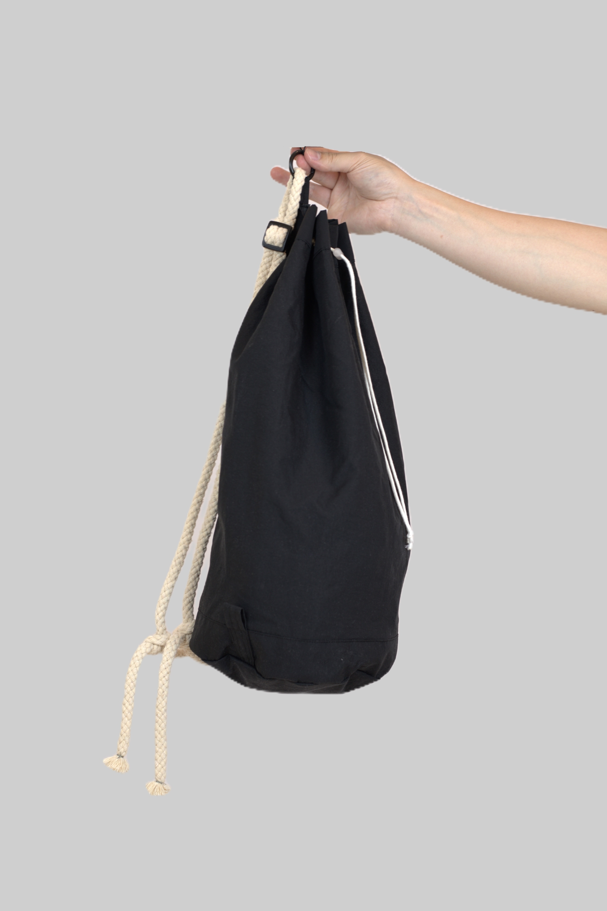

**와디즈([wadiz.kr](https://wadiz.onelink.me/gmeA/6nkc1bki))에서 월터백v3의 리워드 펀딩을 진행하고 있습니다.**

# "용기 있는 이들의 이야기로 만든 제품, 당신의 도전을 응원합니다."

# HISTORY

2019년 spades by clubs라는 이름으로 와디즈에서 두차례 펀딩을 진행 했었습니다.

2024년 LAKE PHILOSOPHY라는 이름으로 다시 와디즈를 통해 펀딩을 진행합니다.

# ABOUT

LAKE PHILOSOPHY는 호수의 고요한 마음을 상징합니다.

마음의 안정된 상태, 무엇인가에 몰입되어 불안과 걱정에서 자유로운 상태와 같이 자연의 아름다움을 만끽 했을때 찾아오는 자유로움을 표현하고자 했습니다.

# VALUE

상상만으로만 꿈꾸던 일이 실현 됩니다. 행동하고 부딪히고 도전하고 시도하는 모든이의 스토리를 제품으로 만듭니다. 

# PROUDT

## Walterbag 스토리

우연히 보게 된 영화**"월터의 상상은 현실이 된다"**에서 가슴이 뜨거워 졌다.

주인공처럼 나도 상상으로만 생각 했던 일이 현실로 일어날 것 같았다. 

저 가방을 메었을 때부터 그의 모험이 시작된 것 같았다. 저 가방을 가지고 싶었다.

그런데 어디에도 팔지 않았다. 그래서 만들기로 했다.

> 터닝포인트

모든 것이 처음이라 하나하나 알아가는 과정이 쉽지 만은 않았다.

지방에 살고 있어 서울로 올라가 원단도 알아보고

부자재도 신중하게 고르고 또 골랐다.

3개월 간 봉제학원까지 다니며 제봉을 배웠고

그렇게 가방은 완성 되었다.

## 용기의 여정을 함께할 'WalterBag_v3'

심리학자 알버트 반두라는 그의 논문 "Self-effic,acy: Toward a unifying theory of behavioral change" (1977)에서 <u>우리가 타인의 성공을 목격할 때 "나도 할 수 있다"는 자신감을 얻는다고 설명합니다. 이를 '대리 경험'이라고 하죠. 우리가 동경하는 누군가가 도전을 극복하는 모습은 우리에게 강력한 동기부여가 됩니다</u>.**WalterBag은 바로 이 원리에서 탄생했습니다**. 이 가방은 단순한 소지품 이상의 의미를 지닙니다. 이는 여러분의 내면에 잠든 모험가를 일깨우는 상징입니다. "**영화 속 주인공이 이 가방과 함께 놀라운 여정을 떠났듯이, 여러분도 각자의 이야기를 써내려갈 수 있습니다.**"

# 스토리를 제품으로

**당신의 다양한 꿈, 목표, 도전이 모티브가 되어 제품을 만듭니다.**

## **안녕하세요, 저는 메이커 Lake입니다.**

몇번의 사업에 실패하고 자존감도 낮아 졌습니다. 잠이 오지 않는 밤에 무작정 하염없이 걸었습니다. 해가 뜰때까지 걸었을 때 감사하게도 더이상 떨어질 곳이 없으니 이제는 올라갈 일만 남았다고 생각이 들었고 목표도 생겼습니다.

"나의 상상은 현실이 된다" 

자기에 자리에서 최고가 된 사람 혹은 도전하고 나아가는 사람들을 많이 알게 되었습니다. 그 사람들의 이야기를 제품으로 만들고 싶습니다. 그들의 도전이 여러분에게도 전해 지리라 믿습니다.

용기 있게 도전하고 성장하는 당신의 이야기가 우리 브랜드의 가치입니다. 

**레이크 필로소피**는 호수의 고요한 마음을 상징합니다. 

# 색상 및 360˚

**4가지 색상**을 준비 했습니다.

## <u>Black</u> 블랙

## <u>Sky</u> 스카이

## <u>Lilac</u> 라일락

## <u>Olive</u> 올리브

# 무엇이 달라졌나?

월터백은 2019년 3월에 와디즈를 통해 처음 펀딩을 했습니다. 그리고 약 5년만에  새로운 버전을 선보이게 되었습니다.

#### 1. 브랜드

마음가짐과 철학이 달라졌어요. 2019년에는 모든 것이 처음이라 실수가 많았고 제품도 운영도 마음가짐도 다 부족했습니다. 브랜드의 가치 있는 활동을 통해 많은 사람들이 용기를 가지고 도전하고 성장하는 것에 초점을 맞춰 운영하겠습니다.

철학이 생겼고 방향성도 달라졌기에 새로운 로고와 브랜드 네임을 변경하게 되었습니다.

#### 2. 원단과 부자재

기존의 원단은 유럽의 Ventile이라는 역사가 있고 기능성이 또한 좋은 제품이었지만 이번에는 국내의 친환경 제품을 찾았습니다. 국내 기업 AMCOMPANY의 친환경 플라스틱 리싸이클 제품으로 국내에서 가방에 많이 쓰이는 대중적인 원단을 선택하게 되었습니다.  또한 지퍼도 YKK에서 HHH로 바꾸었습니다. HHH(태평양지퍼) 국내외에서 굉장히 신뢰 받는 기업으로 제품 자체로도 우수합니다. 

#### 3. 사용 편의성

사용 편의성을 고려해 상단 O링 비너와 사이드백 스타일에서 백팩 형태로 변형이 쉽게 하기 위해 회전 개고리를 추가하였습니다. 사용자의 기호에 따라 다양하게 커스텀 해서 사용 가능해서 자신만의 개성을 살릴 수 있습니다.

개고리를 통해 빠르게 사이드/크로스에서 백팩 형태로 변환이 쉬워 졌습니다. 

#### 4. 다양한 색상

대중적인 검정색이 필요하다고 생각 했고 자신의 스타일에 따라 색상의 폭을 최대한 생각했습니다. 스카이 색상은 성별에 상관 없이 밝은 느낌이 들어 일상에서 언제든지 포인트가 될 수 있습니다. 라일락 색상은 여성스러우면서 귀여운 연출을 할 수 있습니다. 올리브 색상은 스토리의 아이덴티가 들어갔다고 할 수 있습니다.

## 리싸이클 원단

**RE-CYCLY 나일론 사용**

원단62%의 나일론과 38%의 리싸이클 나일론으로 제작된 원단으로 은은한 광택감을 주면서 코팅을 덧입혀 내구성을 강화하였습니다.  
우리의 소비 선택이 환경 보호와 지속 가능한 패션 산업에 긍정적인 영향을 미칠 수 있는 메시지를 전합니다.  
단순히 옷을 넘어서 우리의 가치와 의식을 대변합니다.

**솔라 트윌의 유니크한 외관 표현**

솔라 트윌의 조직감을 통해 두 가지 형태의 트윌이 복합적으로 보여져 일반적인 트윌의 형태보다 독특한 외관을 가지고 있습니다.  
몸에 들러붙지 않는 거슬거슬한 터치감과 형태 안정성이 뛰어나 의류 및 모자, 가방 등 다양한 악세서리류에 사용할 수 있는 멀티 원단입니다.

**제품의 외관과 실용성을 강화시킨 후가공 적용 원단**

에어로 공정을 통해 원단의 은은한 자연스러운 구김을 구현하였습니다.  
편안하고 자유로운 움직임을 제공하면서도 원단의 품질과 외관을 향상시킴으로써 세련된 스타일을 제시합니다.  
<u>발수가공이 적용되어 일상의 다양한 환경에서도 생활발수</u>가 가능합니다.

## 가벼운 무게

#### <u>195g, 스마트폰 보다 가벼운 무게</u>

***로프 및 O링, 개고리 제외시 119g**

## 상세 사이즈

**내부 통과 지퍼 : 30cm**

**분리 보관 주머니 지퍼 : 20cm**

**가로 세로 높이 사이즈 :  22X22X52cm (원통형)**

## 부자재 소개

<u><strong>HHH 지퍼 슬라이드 (3호)</strong></u>

HHH 태평양 지퍼는 1980년에 창업해 세계에서 입지를 넓혀 가고 있고 기술력을 인정 받고 있습니다.

**<u>HHH 지퍼 테이프</u>**

HHH 태평양 지퍼는 1980년에 창업해 세계에서 입지를 넓혀 가고 있고 기술력을 인정 받고 있습니다.

**<u>붕어 회전 개고리&nbsp;</u>**  

여닫이가 사이드에 팁이 있어 사용에 용이합니다.

**<u>O링 비너 (내경 25mm)</u>**

가방 상단 고리에 연결하여 악세사리나 인형등을 걸어서 사용가능합니다.

**<u>면 꼬임 로프 (12mm)</u>**

천연 재료인 방적사로 만들어져 부드럽고 이 가방의 디자인적으로 가장 큰 포인트가 됩니다.

#### 끈(로프) 개고리 이동

#### 끈(로프) 길이 조절

#### 내부 통과 지퍼 이용

#### 상단 링 비너 이용

#### 상단 스토퍼 이용

#### 주머니 지퍼 이용

#### Reward List

### 발송 및 프리오더 안내

- 배송 방법

리워드에 공지된 일정대로 대한통운 택배사를 통해 발송됩니다. 리워드에 따라 나누어지니 서포터님의 배송 일정을 꼭 확인하세요. 배송이 시작될 때마다 새 소식을 통해 내용 공유해 드리겠습니다. 

**3PL 업체를 통해서 배송 될 경우 자체 배달 혹은 택배사가 변경 될 수 있음을 알려드립니다.**

- 제주/도서 산간지역 배송비

제주/도서산간에 따른 추가 배송비는 마테마틱이 부담하므로 서포터님이 부담하실 추가 배송비는 없습니다.

- 생산시 부자재 및 라벨 디자인은 변경될 수 있습니다. 

- 배송 시 포장상태

비닐 포장 + 택배 박스포장 또는 택배비닐로 진행됩니다.

- 리워드 포장 방법 및 수령 후 보관 시 유의 사항

리워드 제품은 꼼꼼히 검수하여 비닐 포장하여 출고됩니다.

수령 후 사용에 문제가 없으신지 살펴봐 주시고 사용 후 부드러운 천으로 닦아 보관해 주세요. 제품을 하나하나 검수하지만, 혹여라도 제품 하자가 있을 수 있으니 수령 후 14일 이내에 카카오 채널로 문의하시면 신속하게 처리해 드리겠습니다!

### 서포터 안내

- 리워드 옵션/배송지/카드정보는 펀딩 마감일까지 마이와디즈> 펀딩/프리오더 하기> 펀딩/프리오더 내역 페이지에서 수정가능합니다.

- 펀딩 마감 이후 불가피한 사유로 배송지를 변경해야 하는 분은 해당페이지 내 메이커에게 문의하기를 통해서 문의해 주세요.

※ 최종 결제일까지는 와디즈로 문의(와디즈 고객센터 1661-9056) 주시고 이후에는 레이크필로소피로 문의주세요. 그래야 빠르게 도와드릴 수 있답니다!
